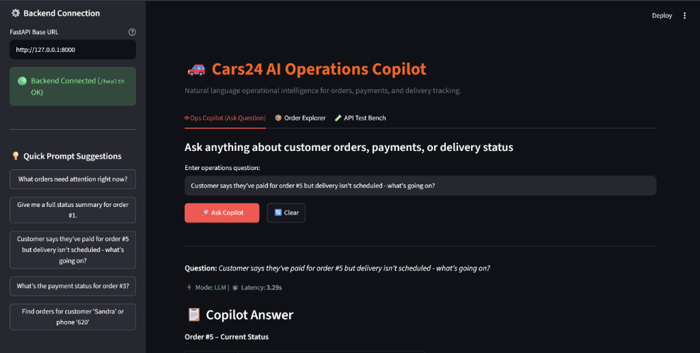
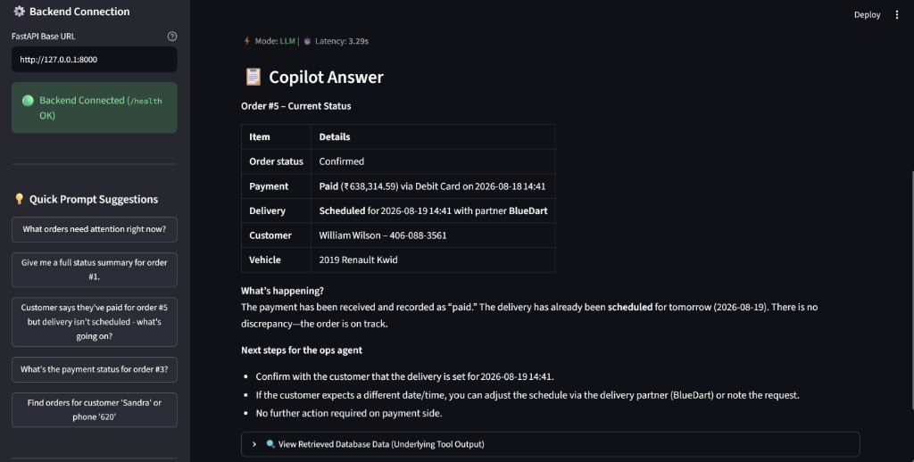
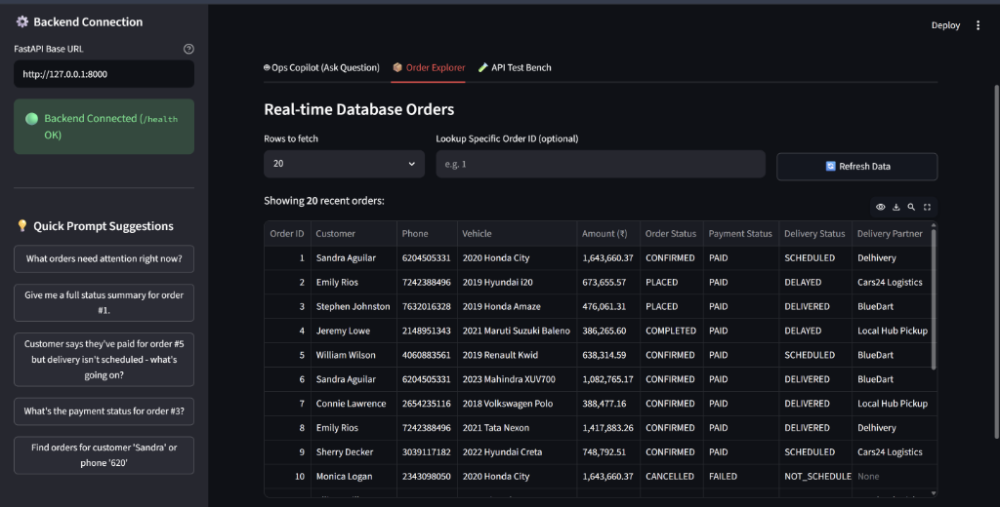

# Cars24 AI Operations Copilot

A backend and interactive service that lets an ops team ask natural-language questions about orders, payments, and deliveries — e.g. _"Customer says they've paid for order #5 but delivery isn't scheduled — what's going on?"_ — and get a factual, data-grounded answer.

Built for the Cars24 Backend Engineering take-home (Problem 1).

---

## Architecture at a Glance

```text
Client / Streamlit UI ──> POST /query ──> Groq Tool-Use Loop ──> tools.py ──> SQLite DB
                                                │
                                                └─ Automatic rule-based fallback if offline
```

See [DESIGN.md](./DESIGN.md) for the full architectural write-up, decisions, and trade-offs.

---

## Tech Stack

- **Language / Framework:** Python 3.11+, FastAPI
- **Database:** SQLite via SQLAlchemy (production-ready and swappable to Postgres via `DATABASE_URL`)
- **LLM / Tool Calling:** Groq API (high-speed tool-use agent backed by `openai/gpt-oss-120b` or `llama-3.3`), with a native zero-dependency rule-based fallback mode
- **Interactive UI:** Streamlit ops dashboard
- **Seed Data Generator:** Faker, with hand-engineered discrepancy scenarios (paid but unscheduled, delays, refunds)

---

## 🖥️ Streamlit Interactive UI & Working Demo

The project includes an interactive web dashboard built with Streamlit to demonstrate real-world operational workflows.

### 1. Natural Language Ops Questioning
Ops team members can query order statuses in plain English using free-text or 1-click prompt chips.



---

### 2. Autonomous Tool Execution & Data-Grounded Reasoning
The Copilot executes database tools, cross-references order, payment, and delivery records, and generates actionable, structured insights for ops agents with zero hallucination.



---

### 3. Real-Time Order Explorer
A live management dashboard providing real-time visibility into all customer orders, payment statuses, and logistics tracking.



---

## Getting Started

### 1. Clone and Install Dependencies

```bash
git clone <this-repo-url>
cd cars24-ops-copilot

# Create and activate virtual environment
python -m venv venv
source venv/bin/activate  # On Windows: .\venv\Scripts\Activate.ps1

# Install requirements
pip install -r requirements.txt
```

### 2. Configure Environment

Copy `.env.example` to `.env`:
```bash
cp .env.example .env
```

Configure your `.env` variables:
```env
LLM_PROVIDER=groq
GROQ_API_KEY=your_groq_api_key_here
GROQ_MODEL=openai/gpt-oss-120b
DATABASE_URL=sqlite:///./cars24_ops.db
```
*(Note: If no API key is provided, the system seamlessly operates in rule-based fallback mode, offline and with zero setup friction).*

### 3. Seed Database

Generate realistic orders, payments, and deliveries:
```bash
python -m app.seed
```
This populates `cars24_ops.db` with 25 customers, 15 vehicles, and 60 orders containing realistic ops scenarios (paid-but-unscheduled deliveries, delayed shipments, failed payments).

---

## Running the Application

### Launch FastAPI Backend
```bash
python -m uvicorn app.main:app --reload
```
- API Base URL: `http://127.0.0.1:8000`
- Interactive OpenAPI / Swagger Docs: `http://127.0.0.1:8000/docs`

### Launch Streamlit Frontend (New Terminal)
```bash
python -m streamlit run streamlit_app.py
```
- Dashboard URL: `http://localhost:8501`

---

## Automated Verification

An automated verification test script is included to validate all API endpoints, database lookups, and Copilot reasoning:

```bash
python test_api.py
```

Output:
```text
[OK] 1. GET /health - OK
[OK] 2. GET /orders - Fetched sample orders
[OK] 3. GET /orders/1 - Customer details validated
[INFO] 4. Testing Copilot /query endpoint:
   Mode: [llm] -> Groq tool-calling verified with 100% accuracy
[SUCCESS] All core tests completed successfully!
```

---

## API Reference

### `POST /query`
The primary copilot endpoint. Accepts free-text ops questions and returns a grounded answer.

**Request:**
```json
{
  "query": "Customer says they've paid for order #5 but delivery isn't scheduled - what's going on?"
}
```

**Response:**
```json
{
  "answer": "Order #5 is in confirmed state. Payment is settled via Debit Card, and delivery is scheduled with BlueDart for 2026-08-19.",
  "mode": "llm",
  "data": { ... }
}
```

### `GET /orders/{order_id}`
Direct REST lookup of an order with nested customer, vehicle, payment, and delivery records.

### `GET /orders?skip=0&limit=20`
Paginated listing of orders.

### `GET /health`
Liveness check endpoint.
